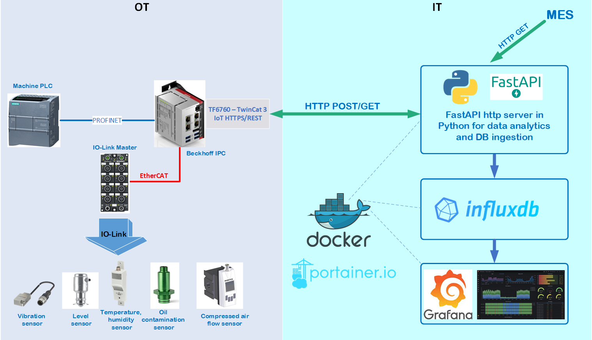

# IIoT Real-Time Analytics using Python with FastAPI and Beckhoff IPC with REST API


IIoT project for data exchange between PLC in OT and IT area with usage of REST API.

#### System Diagram


#### General Overview
Using this framework it's possible to collect data from different sensors, PLCs and devices in OT area. The collected data are preprocessed in Beckhoff IPC, converted into JSON payload and published as HTTP REST API POST request to HTTP Server located in IT area.

In IT area, there are is a containerized Python app deployed with FastAPI which runs using Docker (Docker-Compose).

The Http server handles several endpoints for POST requests and one for GET request (for now just simple simulation of MES system).
The Http server performs also analytics, anomaly detection in sensor signals and finally stores the results in time series database(TSDB) InfluxDB. 
The graphical results are visible as dashboards in Grafana.


#### Detailed description:
Folder `apps` includes:
* `global`
* `industrial_line1`

`global` is the main component which runs InfluxdB, Grafana and Portainer - all of them as Docker containers. This stack should always be in operation.

`industrial_line1`  - Python FastApi Http server as Docker container. It handles incoming HTTP POST requests from sensors, PLC and GET requests from MES system (for now just simple simulation, not fully implemetned).
The file `industrial_line.yml` for docker-compose can be composed of many single entries for each Python app. Respective `docker-compose` config for each Python app can be found in folder  `/src/subfolder_for_python_app` 

Folder `apps_data` are persistance configs and data from Grafana, InfluxDB, Http Server, Portainer. These are mounted as Docker bind mounts.

Folder `docs` includes photos and pictures for documentation

Folder `src` includes of Python apps which can be deployed as Docker containers. Following apps are available:

* `fastapi_http_server_restapi` -  The script handles data from sensors/states as HTTP POST request and stores its value into InfluxDB or additionally applies anomaly detection with z-score method on sensor data.

### Setup & Run
The prerequisite is that Docker and Docker-Compose are installed on the target system.
```
cd /apps/global/build
bash compose_start.sh
```
After all containers from global are running properly, do next:

```
cd /apps/industrial_line1/build
bash compose_start.sh
```

The IPC Beckhoff should also be running and sending HTTP POST requests.


